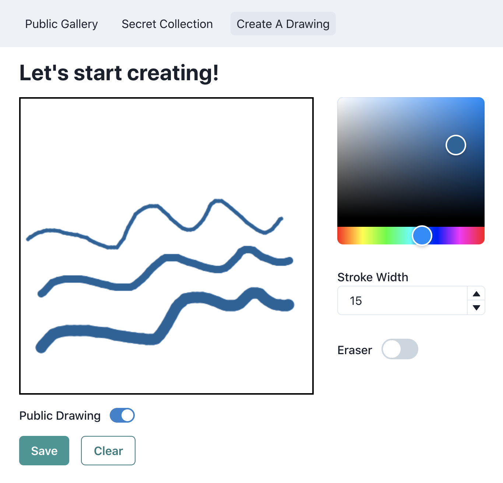

# Drawshare 🖌

Drawshare is an app for sharing sketches.

> 🧪 **Experimental**: This project is not meant to be deployed to production, and is simply a learning exercise.

## 📸 App screenshots




## 🚀 Run the app

**Prerequisites**: Node.js v14

If you have [NVM](http://nvm.sh/) installed, you can run:

```sh
nvm install
```

Then, in one terminal start up the API server:

```sh
cd api
npm install
npm start
```

In another terminal, start up the web app:

```sh
cd web
npm install
npm run build
npm start
```

## 🏗 Architecture

The frontend was built with [React](https://reactjs.org/) and [Next.js](https://nextjs.org/), while the backend was built with [Express](https://expressjs.com/) and [Feathers](https://feathersjs.com/).

## Frontend

Located in the `web` directory. Major parts of the file structure:

```
.
├── ./components: presentational components
├── ./contexts: global data
├── ./features: business logic
├── ./pages: file-based routes
├── ./public: static files
└── ./api.js: api client
```

### Frontend Design Decisions

Major parts of the stack:

- [Next.js](https://nextjs.org/): a React framework with (SSR) server side rendering. Provides some opinions such as file-based routing so that developers who are already familiar with Next.js can contribute right away.
- [Chakra UI](https://chakra-ui.com/): a component library which provides a set of accessible, themable, and composable blocks. Not having to focus on building a design system helps speed up development of business features.
- [Formik](https://formik.org/): a form library to help simplify state management for forms.
- [TypeScript](https://www.typescriptlang.org/): Next.js supports TypeScript, and enabled strict mode improves stability.

This stack works well to develop a maintainable codebase by standardizing how the UI is built. The low amount of [custom components](./web/components/index.tsx) and overall code helps prove this.

The messiest part of the codebase is the [`<Draw>` component](./web/features/draw/index.tsx) as it contains all the complexities of the canvas drawing functionality. It also is tied to the business logic of saving the drawing to the API, which if refactored should be passed as a callback prop to a presentational component instead. However, this component works well for the current MVP and any abstractions may be too early.

To save extra development time, data fetching was done via the [Feathers Client](https://docs.feathersjs.com/api/client.html#node). This could be drammatically improved in terms of security by not persisting the authentication token (JWT) to localStorage. Instead, the JWT should be stored in a secure HTTP-only cookie. [React Query](https://react-query.tanstack.com/) could also be used here to add caching and simplify state management of data.

Also while I attempted to write components to be testable (mainly by abstracting logic to hooks), actually writing tests with [Jest](https://jestjs.io/) and [Testing Library](https://testing-library.com/) would probably uncover more issues that would help improve the codebase.

## Backend

Located in the `api` directory.  Major parts of the file structure:

```
.
├── ./config: environment-based configuration
├── ./data: nedb file-based database
├── ./public: static files
└── ./src/
    ├── ./src/models: database models
    └── ./src/services: api endpoints
```

### Backend Design Decisions

Major parts of the stack:

- [Feathers](https://feathersjs.com/): a Node.js framework with [Express](https://expressjs.com/) integration. This helped initial development going very quickly by allowing quick scaffolding of authentication and CRUD endpoints.
- [NeDB](https://dbdb.io/db/nedb): a file-based database to help simplify setup. All database adapters in Feathers support a [common API](https://docs.feathersjs.com/api/databases/common.html) which makes swapping databases possible. For production use, I would instead use [PostgreSQL](https://www.postgresql.org/) as I find relational databases more easily scalable.
- [TypeScript](https://www.typescriptlang.org/): Next.js supports TypeScript, and enabled strict mode improves stability.

This stack works well to develop a quick MVP, but is missing common requirements of APIs such as an access control system. I implemented some basic validation and ownership checks which you can see in the [users hooks](./api/src/services/users/users.hooks.ts) and [drawings hooks](./api/src/services/drawings/drawings.hooks.ts).

I would implement a role-based system using [feathers-permissions](https://github.com/feathersjs-ecosystem/feathers-permissions) and add unit tests to ensure that future code changes would not break security of the API.

### API Endpoints

All endpoints are RESTful and respond with a 200 status code on success, or 201 status code on successfully created entities. See the [Feathers Services Docs](https://docs.feathersjs.com/api/services.html) for more, as well as the `api/src/services` directory.

#### Create User

- URL: `http://localhost:3030/users`
- Method: `POST`
- JSON Payload:
```json
{
    "email": "sunny@example.com",
    "password": "test",
    "username": "sunny"
}
```

#### Authenticate

- URL: `http://localhost:3030/authentication`
- Method: `POST`
- JSON Payload:
```json
{
    "email": "sunny@example.com",
    "password": "test",
    "strategy": "local"
}
```

#### Create Drawing

- URL: `http://localhost:3030/drawings`
- Method: `POST`
- JSON Payload:
```json
{
    "username": "sunny",
    "steps": [
        {
            "fromX":24,
            "fromY":60,
            "toX":28,
            "toY":73,
            "color":"#000000",
            "strokeWidth":5
        }
    ],
    "createdAt":1615901840380,
    "drawTime":4138,
    "isPublic":true
}
```

#### Delete Drawing

- URL: `http://localhost:3030/drawings/<ID>`
- Method: `DELETE`

#### Get Drawing Detail

- URL: `http://localhost:3030/drawings/<ID>`
- Method: `GET`
- JSON Response:
```json
{
    "username": "sunny",
    "steps": [
    {
        "fromX": 24,
        "fromY": 60,
        "toX": 28,
        "toY": 73,
        "color": "#000000",
        "strokeWidth": 5
    }
    ],
    "createdAt": 1615862444911,
    "drawTime": 1518,
    "isPublic": true,
    "userId": "n9bq8CtYrvK48ZyK",
    "_id": "bJd3ixeRSXIPcwf6"
}
```

#### Get Drawings List

Refer to [Feathers Querying Docs](https://docs.feathersjs.com/api/databases/querying.html#querying) for more complex queries.

- URL: `http://localhost:3030/drawings?isPublic=true`
- Method: `GET`
- JSON Response:
```json
{
  "total": 1,
  "limit": 10,
  "skip": 0,
  "data": [
    {
      "username": "sunny",
      "steps": [
        {
          "fromX": 24,
          "fromY": 60,
          "toX": 28,
          "toY": 73,
          "color": "#000000",
          "strokeWidth": 5
        }
      ],
      "createdAt": 1615862444911,
      "drawTime": 1518,
      "isPublic": true,
      "userId": "n9bq8CtYrvK48ZyK",
      "_id": "bJd3ixeRSXIPcwf6"
    }
  ]
}
```
